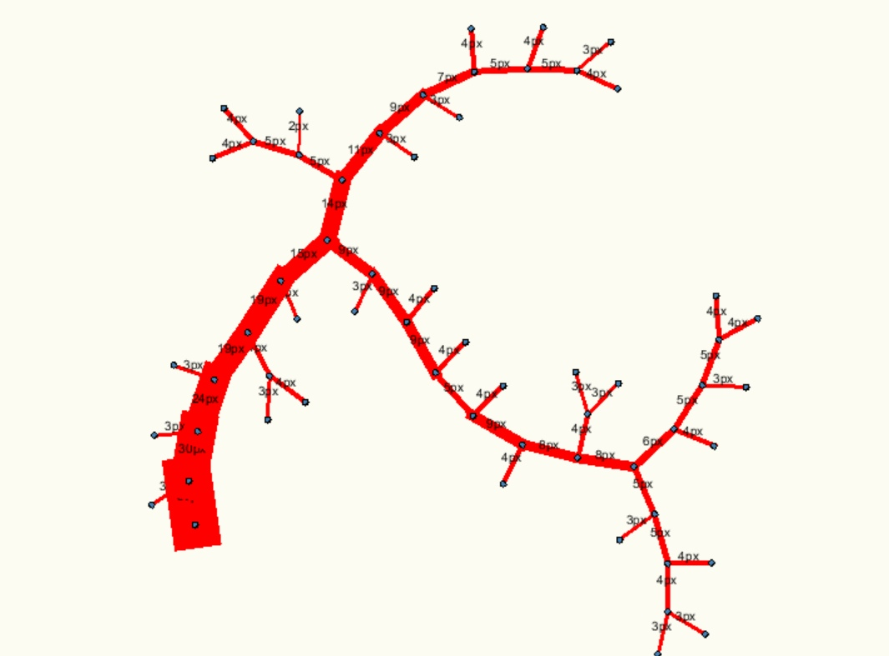
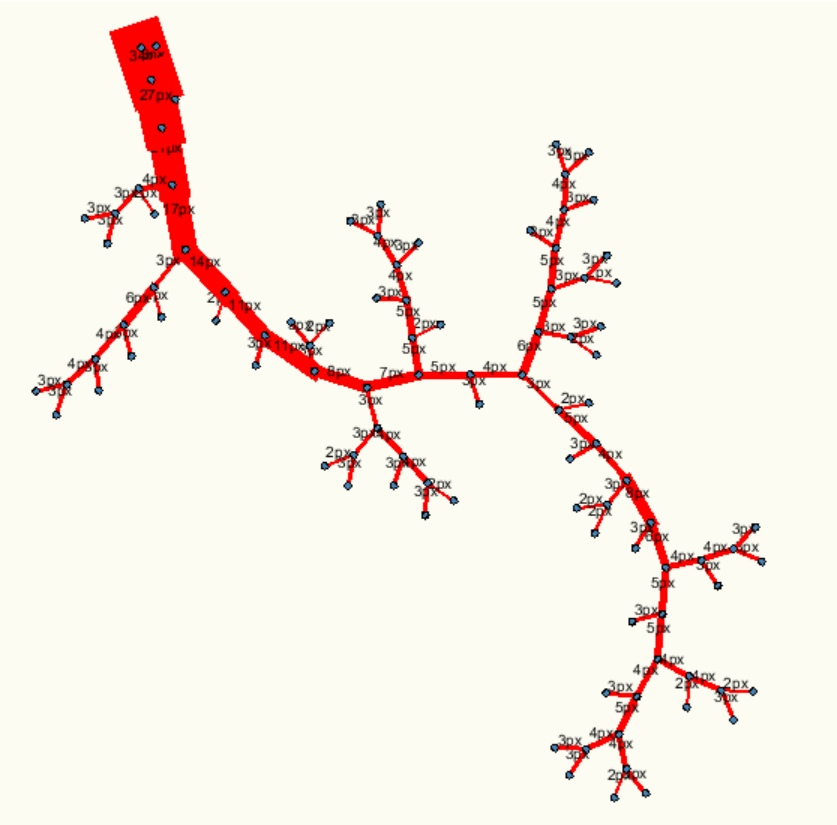
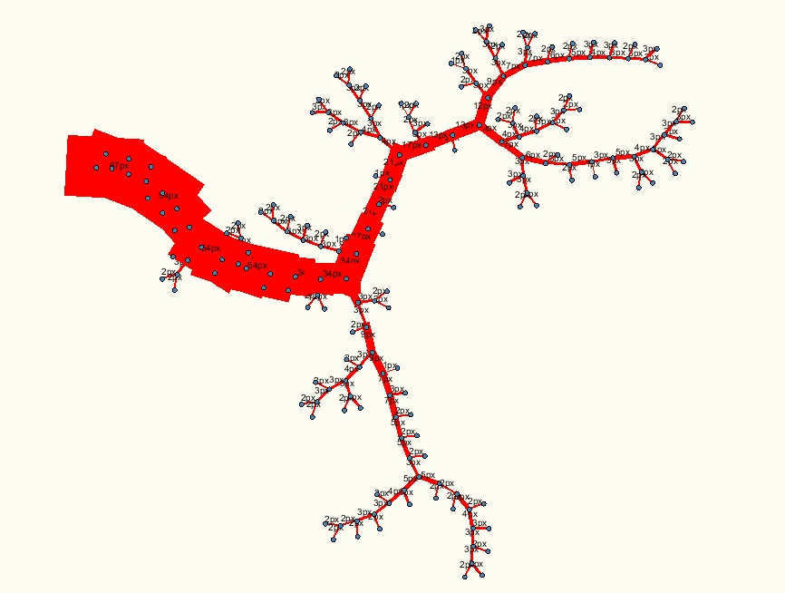
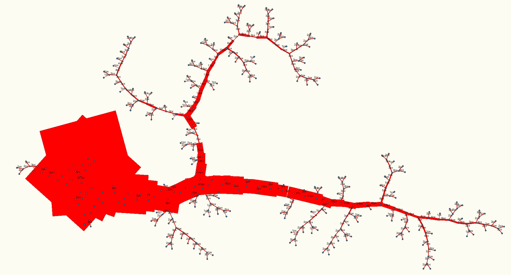

# Arterial Tree Generator
 based on Wolfgang Schreiner et. al., Computer-Optimization of Vascular Trees, IEEE TRANSACTIONS ON BIOMEDICAL ENGINEERING, 1993
 
 **30 nodes:**
 
 
 
 **50 nodes:**
 
 
 
 **100 nodes:**
 
 
 
 **300 nodes:**
 
 
 
